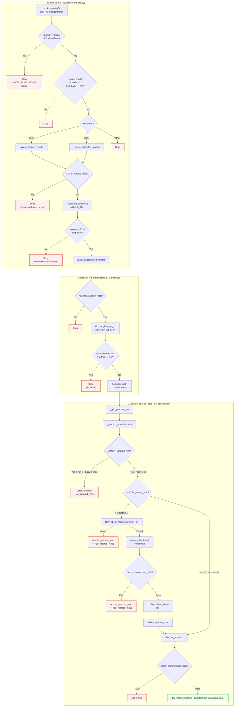

# HCI Monitor Tap — Advertisement Processing Pipeline

## Overview

BLE advertisements are received via an HCI monitor channel tap — a passive,
read-only socket (`HCI_CHANNEL_MONITOR`) that sees ALL HCI traffic between
the host and every Bluetooth controller.  This is the same mechanism that
`btmon` uses.  It bypasses BlueZ's `AdvertisementMonitor1` filtering
entirely, eliminating the need for Bleak, dbus-fast, or any BlueZ scanning
API.

The tap does not issue any commands and does not interfere with BlueZ or
tie up any adapter.

## Processing Pipeline

The diagram below shows every filter stage a raw HCI packet passes through
before reaching a device class.  Red nodes are drop points; the green node
is the final delivery.

## Filter Stages

| # | Stage | Location | Thread | What it drops |
|---|-------|----------|--------|---------------|
| 1 | Event code fast-path | `parse_monitor_frame` | Tap | ~80% of raw traffic (MGMT events, non-LE) |
| 2 | Opcode check | `parse_monitor_frame` | Tap | Non-`HCI_EVENT_RX` frames |
| 3 | Subevent check | `parse_monitor_frame` | Tap | Non-advertising LE Meta subevents |
| 4 | MAC-level filter | `_parse_legacy/extended_reports` | Tap | Previously-rejected MACs (before AD parsing) |
| 5 | Manufacturer ID filter | `_walk_ad_structures` | Tap | Unknown company IDs |
| 6 | Deduplication | `_on_advertisement` | Tap | Identical data from same MAC within 15 min |
| 7 | Thread boundary | `GLib.idle_add()` | Tap → Main | *(not a filter — bridges to main thread)* |
| 8 | `_ignored_mac` check | `_process_advertisement` | Main | MACs rejected in a prior cycle |
| 9 | Device class lookup | `_process_advertisement` | Main | Manufacturer IDs with no registered `BleDevice` subclass |
| 10 | `check_manufacturer_data` | `_process_advertisement` | Main | Device-specific validation (e.g., Mopeka NIC check) |
| 11 | Delivery | `handle_manufacturer_data` | Main | *(final delivery to device class)* |

## Threading Model

Two threads cooperate:

- **Tap thread** (`hci-monitor-tap`): runs `run_tap_loop`, calls
  `_on_advertisement` on the tap thread.  All filtering through stage 6
  happens here.  The `_tap_ignored_macs` set is shared with the main
  thread (CPython GIL guarantees safety for `in` and `add()`).

- **GLib main thread**: runs the GLib main loop, handles D-Bus.  Stages
  8–11 execute here.  The `_prune_tick` timer (every 30s) syncs the
  ignored MAC set: entries that expired from `_ignored_mac` or were
  promoted to `_known_mac` are removed from `_tap_ignored_macs` so
  those devices can be re-evaluated.

## Key Constants

| Constant | Value | Purpose |
|----------|-------|---------|
| `DEDUP_KEEPALIVE_SECONDS` | 900 (15 min) | Re-forward identical data as a keepalive |
| `IGNORED_DEVICES_TIMEOUT` | 600 (10 min) | TTL for ignored MAC entries |
| `DEVICE_SERVICES_TIMEOUT` | 3600 (60 min) | TTL for known device entries |
| `SILENCE_WARNING_SECONDS` | 300 (5 min) | Warn if no matching advertisements |
| `ADV_LOG_QUIET_PERIOD` | 1800 (30 min) | Per-device log throttle period |
